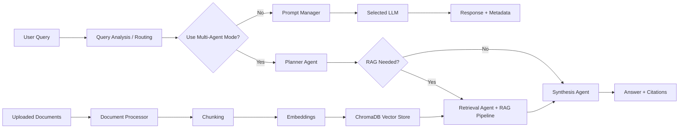

# AI / Data Science Portfolio Repository

This repository documents my hands-on progression through machine learning, NLP, LLM engineering, retrieval-augmented generation, and multi-agent systems.

The centerpiece of the repository is a production-style capstone: a **Multi-Agent Research Assistant** built with Python, Streamlit, CrewAI, and a modular RAG pipeline. Around it, the repository also preserves weekly assignments, notebooks, reports, and presentations that show how the project evolved from core ML foundations into applied GenAI system design.

## What This Repository Shows

- End-to-end Python project organization with Poetry-based dependency management
- Practical ML and NLP work across EDA, classical machine learning, text analytics, and LLM systems
- A multi-provider LLM layer supporting both local and cloud models
- Intelligent model routing based on query complexity, latency, quality, and cost tradeoffs
- Retrieval-augmented generation with document ingestion, chunking, embeddings, vector search, and citations
- Multi-agent orchestration for planning, retrieval, and synthesis workflows
- Streamlit UI for interactive experimentation, observability, and exportable outputs

## Featured Project

### Multi-Agent Research Assistant

The capstone project in `project/` is a research assistant designed to answer user questions using a combination of:

- direct LLM generation for simpler queries
- conditional RAG retrieval for grounded responses
- intelligent model selection across local and cloud providers
- agent-based collaboration for planning, retrieval, and final synthesis

This project was built iteratively as a practical implementation of modern GenAI engineering concepts: prompt management, local inference, routing, vector search, and agent tooling.

## Key Capabilities

### 1. Unified LLM Access Layer

The application provides a consistent interface for multiple model providers:

- Ollama for local inference
- Cerebras for fast cloud inference
- Mistral for higher-quality API responses
- OpenRouter for access to GPT-class models

The LLM layer includes:

- retry handling with exponential backoff
- streaming and non-streaming generation
- token, latency, and cost tracking
- interchangeable provider/model selection in the UI

### 2. Intelligent Query Routing

The routing module analyzes incoming questions and selects an appropriate model based on:

- estimated complexity
- question type
- token length
- target optimization mode: balanced, cost-optimized, quality-optimized, or ultra-fast

This makes the system practical from an engineering perspective, not just functional: it explicitly manages quality/speed/cost tradeoffs instead of sending every request to the most expensive model.

### 3. Retrieval-Augmented Generation

The RAG pipeline supports:

- document ingestion for `PDF`, `TXT`, and `MD`
- chunking strategies for retrieval experiments
- embedding generation
- ChromaDB-backed vector storage
- semantic retrieval of relevant chunks
- inline source citation formatting

This allows the assistant to produce more grounded answers when user-provided documents are available.

### 4. Multi-Agent Workflow

The capstone uses specialized agents with separate responsibilities:

- **Planner Agent**: analyzes the query and determines whether retrieval is necessary
- **Retrieval Agent**: searches indexed documents for relevant evidence
- **Synthesis Agent**: produces the final answer and uses summarization / fact-checking tools

The workflow conditionally skips retrieval when it is not needed or when no documents are indexed, keeping the system efficient.

### 5. Interactive Interface

The Streamlit app exposes the full workflow through a practical UI:

- model selection or auto-routing
- prompting strategy selection
- RAG toggle and document upload
- multi-agent mode toggle
- routing transparency and performance metrics
- export of generated results to Markdown or text-based report content

## Architecture Overview



## Tech Stack

### Languages and Frameworks

- Python 3.12
- Streamlit
- CrewAI
- Pydantic
- Poetry

### LLM / GenAI Tooling

- Ollama
- OpenRouter
- Mistral AI SDK
- Cerebras Cloud SDK
- LangGraph dependency included as part of the broader agent stack exploration

### Retrieval and Document Processing

- ChromaDB
- sentence-transformers
- pypdf

### Quality Tooling

- Ruff
- Black
- isort
- pytest

## Repository Structure

```text
.
├── project/                  # Capstone: Multi-Agent Research Assistant
│   ├── src/
│   │   ├── agents/           # Agent definitions and orchestration
│   │   ├── llm/              # Provider clients and response models
│   │   ├── prompts/          # Prompt strategies and prompt manager
│   │   ├── rag/              # Document processing, embeddings, retrieval, evaluation
│   │   ├── routing/          # Query analysis and model routing logic
│   │   ├── tools/            # Agent tools for analysis, retrieval, summarization, checking
│   │   └── ui/               # Streamlit application
│   └── tests/
├── weeks/                    # Weekly assignment materials and learning artifacts
│   ├── week1/                # EDA, classical ML foundations
│   ├── week2/                # Clustering, PCA, time series topics
│   ├── week3/                # ML experimentation and notebooks
│   ├── week4/                # NLP / sentiment / topic modeling work
│   ├── week5/                # LLM APIs and prompt engineering
│   ├── week6/                # Local models and fine-tuning concepts
│   ├── week7/                # RAG systems
│   └── week8/                # AI agents and multi-agent systems
├── capstone/                 # Capstone project brief and milestone framing
├── Week5_Presentation.pptx
├── week8_report.pdf
├── pyproject.toml            # Root-level dev tooling configuration
└── README.md
```

## Setup

### Prerequisites

- Python 3.12+
- Poetry
- Ollama installed locally if you want to use local models

### 1. Install Root Tooling

From the repository root:

```bash
poetry install
```

This installs the root-level development tooling configuration used across the repository.

### 2. Install Capstone Project Dependencies

```bash
poetry install --directory project
```

### 3. Configure Environment Variables

The capstone project uses environment variables for model providers. Create a local `.env` file inside `project/` with only the providers you plan to use.

Example:

```env
OLLAMA_BASE_URL=http://localhost:11434
OPENROUTER_API_KEY=your_key_here
MISTRAL_API_KEY=your_key_here
CEREBRAS_API_KEY=your_key_here
```

Notes:

- local-only usage can work with just `OLLAMA_BASE_URL`
- cloud providers require their corresponding API keys
- no secrets should be committed to the repository

### 4. Pull Local Models for Ollama

Example:

```bash
ollama pull gemma3:1b
ollama pull deepseek-r1:1.5b
ollama pull ministral-3:3b
```

## Running the Application

Start the Streamlit app from the capstone directory:

```bash
poetry run --directory project streamlit run src/ui/app.py
```

If your Poetry version does not support `run --directory`, use:

```bash
cd project
poetry run streamlit run src/ui/app.py
```

## Using the Application

Typical workflow:

1. Choose a model directly or enable auto-routing.
2. Select a prompting strategy.
3. Optionally enable RAG and upload documents.
4. Optionally enable the multi-agent workflow.
5. Submit a question.
6. Review the answer, routing decision, citations, latency, token usage, and estimated cost.

Example query types:

- simple conceptual questions that can be answered directly
- document-grounded questions that benefit from retrieval
- more complex research prompts that benefit from planning plus synthesis

## Prompting and Experimentation

The repository includes a dedicated prompt management layer so different prompting styles can be tested through a consistent interface.

This is useful for:

- comparing response quality across strategies
- evaluating prompting behavior across different model families
- demonstrating practical prompt engineering as a system concern, not just ad hoc prompt writing

## Testing and Code Quality

### Capstone Tests

From `project/`:

```bash
poetry run pytest
```

### Linting and Formatting

From the repository root:

```bash
poetry run ruff check .
poetry run black --check .
poetry run isort --check-only .
```

## Portfolio Context

This repository is intentionally broader than a single app. It captures a progression across several areas:

- **ML foundations**: EDA, classical supervised and unsupervised learning
- **Applied NLP**: sentiment analysis, topic modeling, text preprocessing
- **LLM engineering**: API integration, prompting strategies, response metadata, streaming
- **Local inference**: running and comparing local models through Ollama
- **RAG engineering**: ingestion, chunking, retrieval, citation grounding
- **Agent systems**: tool-enabled planning, retrieval, and synthesis workflows

That combination is the main value of the repository from a hiring perspective: it shows both breadth across AI topics and depth in one integrated end-to-end system.

## Selected Artifacts

In addition to source code, the repository also contains supporting materials such as:

- weekly notebooks
- visual analysis outputs
- presentations
- written reports

These artifacts reflect both implementation work and communication of results, which is important for research, product, and applied AI roles.

## Engineering Notes

The repository is designed as a practical learning-and-building workspace rather than a polished SaaS product. That said, the capstone project emphasizes engineering decisions that matter in real systems:

- modular separation between LLM, routing, retrieval, tools, and UI layers
- explicit handling of provider tradeoffs
- observability through metadata and routing visibility
- extensibility for additional tools, providers, and document workflows

## Future Improvements

Natural next steps for the capstone would include:

- stronger automated test coverage for routing and RAG behavior
- benchmark datasets for repeatable evaluation
- richer retrieval quality metrics and offline experiments
- improved agent trace visualization
- deployment packaging for easier public demos

## Summary

This repository represents a focused build path from classical data science tasks to modern AI systems engineering. The strongest part of the work is the **Multi-Agent Research Assistant**, which combines local/cloud model access, prompt experimentation, RAG, routing, and agent orchestration in one coherent application.

If you are reviewing this repository for an ML, NLP, GenAI, or applied AI engineering role, `project/` is the best place to start.
